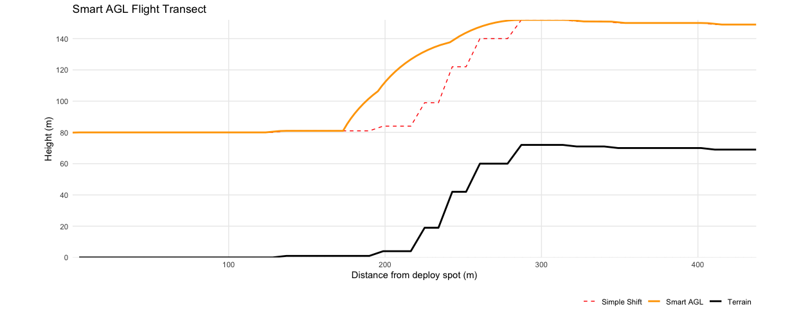

# SMARTAGL: Smart Above Ground Level Flight Transect Planner

## Core Features

* Terrain-aware drone path planning
* Constant AGL altitude maintenance
* UgCS-compatible CSV exports
* 2D profile and 3D interactive maps
* Multi-CRS support

## Installation

```r
# Install from GitHub
if (!require("devtools")) install.packages("devtools")
devtools::install_github("ajcastanedag/SMARTAGL")

# Load package
library(SMARTAGL)
```

## Quick Start

```r
# 1. Define coordinates ("EPSG:3763") and DSM path 
deploy_coords <- c(-110289.7,-62576.0)
land_coords <- c(-110077.1,-62963.2)
dsm_path <- "path/to/dsm.tif"

# 2. Generate flight path 
flight_path <- create_flight_path(
  deploy_coords = deploy_coords,
  land_coords = land_coords,
  dsm_path = dsm_path,
  N = 50,
  H = 80,
  crs_proj = "EPSG:3763"
)

# 3. Visualize
plot_flight_path(flight_path) # 2D profile

# 4. Export for UgCS
export_flight_path(flight_path, "flight_plan.csv")
```



## Variable Reference

### Input Variables

| Variable       | Type        | Description                     | Constraints            |
| -------------- | ----------- | ------------------------------- | ---------------------- |
| deploy\_coords | numeric\[2] | Deployment (x,y) in project CRS | Must match DSM CRS     |
| land\_coords   | numeric\[2] | Landing (x,y) in project CRS    | Must match DSM CRS     |
| dsm\_path      | string      | Path to Digital Surface Model   | GeoTIFF format         |
| N              | integer     | Sample points along path        | ≥2, default = 100      |
| H              | numeric     | AGL height (meters)             | ≥0, default = 10       |
| crs\_proj      | string      | Projected CRS                   | Default = "EPSG:32632" |

### Output Structure

The flight path object contains:

```r
list(
  deploy_coords = c(x, y),       # Original deployment
  land_coords = c(x, y),         # Original landing
  sampled_points = sf object,    # All sampled points
  terrain_line = sf object,      # Raw terrain profile
  simple_shift_line = sf object, # Basic AGL offset
  smart_agl_line = sf object,    # Optimized path
  final_coords = data.frame(     # UgCS-ready waypoints
    X = easting,
    Y = northing,
    Z = altitude_amsl
  ),
  parameters = list(             # Input parameters
    N = N,
    H = H,
    crs = crs_proj
  )
)
```

## UgCS Integration

Exported CSV contains these required columns:

| Column       | Type    | UgCS Mapping      |
| ------------ | ------- | ----------------- |
| WP           | int     | Waypoint sequence |
| Latitude     | decimal | WGS84 latitude    |
| Longitude    | decimal | WGS84 longitude   |
| AltitudeAMSL | decimal | AMSL altitude     |
| Speed        | decimal | Flight speed      |
| Picture      | boolean | Camera trigger    |
